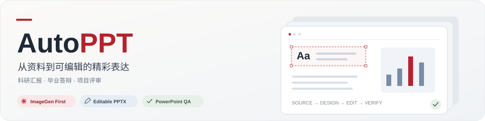
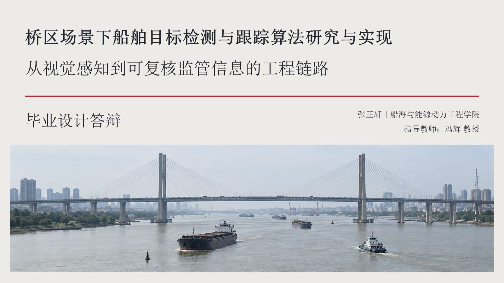
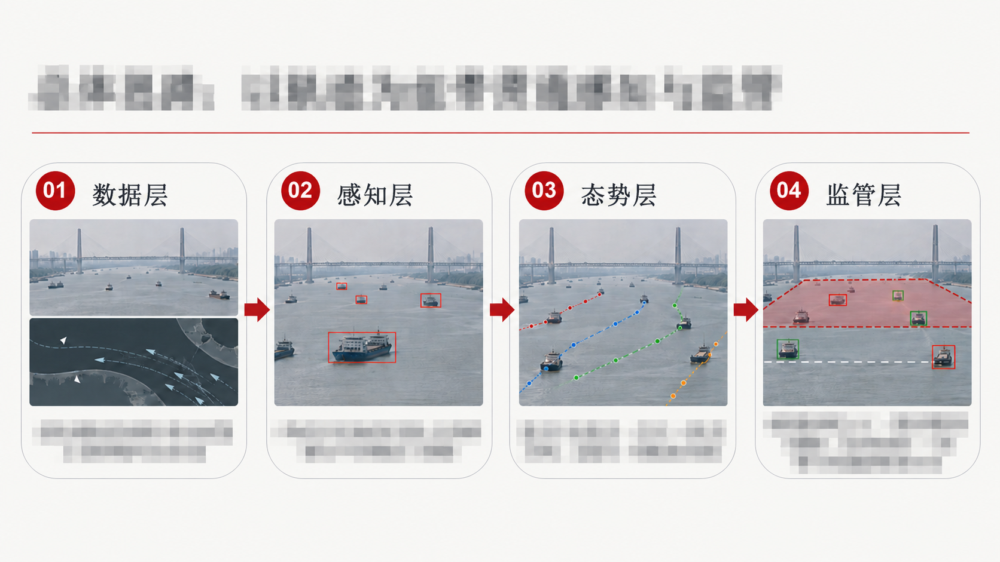
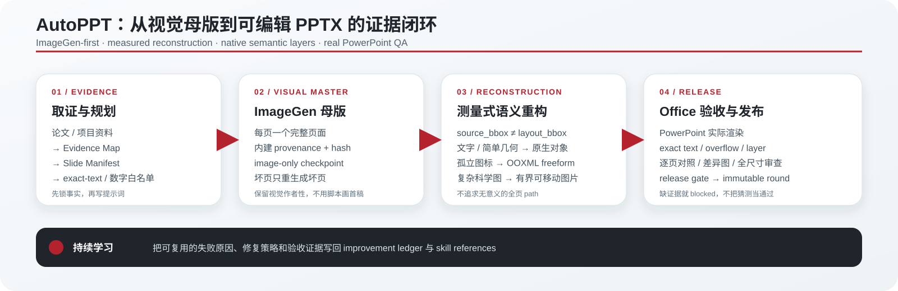

<a id="top"></a>

<div align="center">



### 让研究讲得清楚，让页面值得展示

用 ImageGen 完成整页视觉，再把文字与框图重建为可编辑的 PowerPoint 对象。

📚 **资料有依据**　·　🎨 **页面有信息**　·　✏️ **对象可编辑**　·　🔍 **成品经验证**

[🧭 工作原理](#workflow)　·　[🖼️ 效果展示](#showcase)　·　[🚀 快速开始](#quickstart)　·　[🧩 Skill 与目录](#structure)

</div>

AutoPPT 面向毕业答辩、科研汇报、国自然评审和项目展示，把“内容讲清楚、页面做完整、成品能修改”串成一条工作流。论文与项目资料提供事实依据；ImageGen 生成每页视觉母版；重构工具恢复文字、形状和连接线；最终用 Microsoft PowerPoint 实际渲染、逐页对照。

## 🎁 你会得到什么

| 产物 | 用来做什么 |
| --- | --- |
| 📚 内容与提示词包 | 查看每页讲什么、事实来自哪里、如何生成 |
| 🎨 ImageGen 母版与图片版 PPT | 审核整套视觉，作为重构参照 |
| ✏️ 可编辑 PPTX | 修改文字、移动框图、调整连接线、替换局部图片 |
| 🔍 验收报告与逐页对照 | 核对文字、溢出、图层和最终渲染差异 |

普通文字与简单形状必须可编辑；复杂科研图可以保留为独立图片。**科研表达和视觉保真优先于矢量对象数量。**

<a id="showcase"></a>

## 🖼️ 效果展示

<p align="center">
  
  
</p>

<p align="center"><strong>克制的学术封面</strong>　｜　<strong>图文并茂的内容页</strong></p>

<details>
<summary>🔒 关于示例图的隐私处理</summary>

公开展示副本的课题标题、姓名、院系、导师和具体研究说明已模糊化。图片经 ImageGen 脱敏编辑，仅展示版式，不作为原始渲染对照或验收证据。

</details>

默认风格保持淡色底、深色文字和克制的红色强调。内容页采用中高信息密度，图像配有必要说明；参考经过核验的国自然汇报和高校答辩排版，兼顾整齐、美观与后续重构。完整规则见[已确认的风格契约](autopptskills/references/approved-style-contract.md)。

<a id="workflow"></a>

## 🧭 工作原理



| 环节 | 核心动作 | 完成标准 |
| --- | --- | --- |
| 📚 取证与规划 | 提取事实、锁定术语与数字、设计逐页叙事 | 每条主张能回到来源 |
| 🎨 视觉母版 | 一页一份完整提示词，调用内建 ImageGen | 文字、布局、信息密度通过审核；来源与图片 hash 对应 |
| ✏️ 可编辑重构 | 测量位置、分离背景、按对象类型重建 | 普通文字与简单几何成为真实 PowerPoint 对象 |
| 🔍 Office 验收 | 渲染最终 PPTX、逐页比较、修复差异 | 所有适用检查通过，保留发布证据 |

一页需要修改时，生成新的修订版本，继承已通过的页面。失败原因和有效修复沉淀到经验库，供后续项目复用。

### 哪些内容能编辑？

| 对象 | PPT 中的形式 | 能做的修改 |
| --- | --- | --- |
| 标题、正文、标签、表格文字 | 原生文本框 | 改字、字体、颜色、换行 |
| 边框、箭头、节点、分隔线 | 原生形状与连接线 | 移动、缩放、改线宽和填充 |
| 简单独立图标 | 验收通过的矢量轮廓 | 调整轮廓与样式 |
| 照片、复杂科学图、密集图像 | 有界局部图片 | 移动、裁切、替换 |

最终保真度以 PowerPoint 渲染对照为准。可见的布局、换行、颜色或残影差异会阻塞发布；跨设备字体与抗锯齿造成的差异需要记录和复核，不能预先承诺逐像素相等。

<a id="quickstart"></a>

## 🚀 快速开始

需要 Python 3.11+。正式可编辑成品的验收需要 Windows 与 Microsoft PowerPoint；部分组合工具还需要 Node.js/PptxGenJS，详见[环境说明](ENVIRONMENT.md)。完整流程由可调用内建 ImageGen 的代理执行，命令行负责准备、接收、重构和验收。

```powershell
python -m venv .venv
.\.venv\Scripts\Activate.ps1
python -m pip install -r requirements.txt
python autopptskills/scripts/check_editable_backends.py --json-out .codex-tmp/capabilities.json
```

### 让代理使用 Skill

将仓库中的 `autopptskills/` 安装到你的 Codex skills 目录，在任务中调用：

> 使用 $autopptskills，根据我提供的论文制作答辩 PPT。先核对内容与每页计划，再生成 ImageGen 母版，重构为可编辑 PPTX，并用 PowerPoint 渲染验收。采用淡色学术风格、图文并茂和中高信息密度。

<details>
<summary><strong>⌨️ 命令行进阶：运行已有项目</strong></summary>

项目输入约定见[项目集成](autopptskills/references/project-integration.md)：

```text
<topic-dir>/
  workspace/
    presentation_handoff/      # 定稿材料、slide_brief.json、ppt_outline.md
    evidence_workspace/        # evidence-ledger.json
    idea_brief/                # 可选项目名称等元信息
  final/ppt/                   # 生成、重构、验收产物
```

```powershell
# 验证结构流程；mock 产物不能作为正式交付
python -m autoppt_workflow.scripts.run_presentation_workflow <topic-dir> --mock --presentation-profile thesis_defense

# 接收已验证的内建 ImageGen 结果；缺少图片时返回阻塞报告
python -m autoppt_workflow.scripts.run_presentation_workflow <topic-dir> --real --presentation-profile thesis_defense

# 母版已审核后，按测量计划组合可编辑版本
python autopptskills/scripts/compose_measured_reconstruction.py <run-dir>/measured-plan.json --out-dir <run-dir>/editable-round
```

组合完成后还需执行[QA 与发布检查](autopptskills/references/qa-and-validation.md)。脚本组装成功仅代表该步骤完成，不能据此宣称最终成品已通过验收。

</details>

<a id="structure"></a>

## 🧩 Skill 与目录

仓库只有一个主 skill：[`autopptskills`](autopptskills/SKILL.md)。它覆盖内容规划、视觉生成、可编辑重构和发布验收。重构细则收在同一 skill 的 references 中，避免维护两套重叠规则。安装目录中的副本用于代理加载；仓库源码是维护入口。

| 目录 | 职责 |
| --- | --- |
| 🧭 `autoppt_workflow/` | 工作流编排、证据组织、页面提示词与运行入口 |
| 🧩 `autopptskills/` | Skill 契约、参考规范和可独立安装的重构/验收工具 |
| 🛠️ `scripts/` | 仓库级资料、清单与经验记录工具 |
| 🌱 `improvement/` | 可复用的失败经验、修复记录与风格手册 |
| 📖 `docs/` | 范围说明、操作文档与脱敏展示素材 |
| 🧪 `tests/` | 编排、重构、编辑性与发布检查的回归测试 |

`autoppt_workflow` 和 `autopptskills` 分别承担项目编排与可安装技能包的职责；技能包保留自包含工具以支持独立使用。项目私有资料、历史成品与临时文件保存在被 Git 忽略的运行目录中。

## 📖 验证与深入阅读

```powershell
python -m pytest -q
python autopptskills/scripts/validate_skill_portability.py autopptskills
```

| 想了解什么 | 从这里开始 |
| --- | --- |
| 完整工作流和交付标准 | [Skill 入口](autopptskills/SKILL.md) · [交互展示页](autoppt_workflow_showcase.html) |
| 如何保持学术风格 | [风格契约](autopptskills/references/approved-style-contract.md) |
| 图片如何变成可编辑 PPT | [重构流程](autopptskills/references/image-to-editable-pptx.md) · [测量式重构](autopptskills/references/measured-reconstruction.md) |
| 怎样确认最终文件可靠 | [QA 与发布规范](autopptskills/references/qa-and-validation.md) |
| 这个项目包含什么 | [项目范围](docs/project-scope.md) · [项目清单](project-manifest.json) |

公开展示只使用脱敏素材；真实论文、项目数据和未脱敏的渲染证据应留在私有运行目录中。

---

<p align="center">📚 从可信资料出发，交付可以继续打磨的表达。<br /><a href="#top">↑ 回到顶部</a></p>
