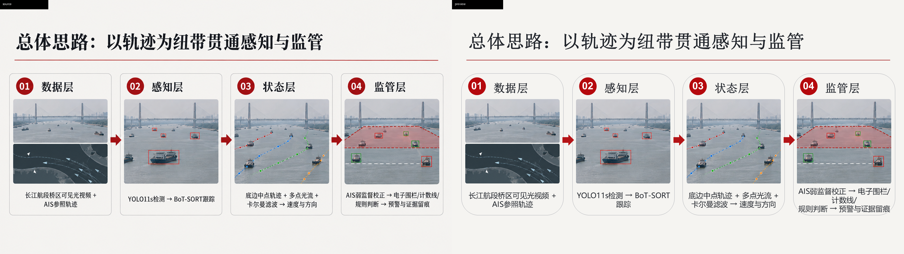

# AutoPPT

> 面向科研汇报、项目评审、创新竞赛与毕业答辩的 **ImageGen-first、证据驱动、可编辑 PPTX 工作流**。

AutoPPT 解决的不是“把几段文字排成一页幻灯片”，而是把**资料事实、视觉表达、语义可编辑性和最终发布证据**放进同一条可复核链路：先生成并冻结完整的视觉母版，再按语义重构为真实的 PowerPoint 对象，最后用 Microsoft PowerPoint 实际渲染、逐页对照和发布门禁确认结果。

<p align="center">
  
</p>

<p align="center">
  <strong>ImageGen-first</strong> · <strong>source-grounded</strong> · <strong>measured reconstruction</strong> · <strong>native semantic layers</strong> · <strong>real PowerPoint QA</strong>
</p>

## 为什么做 AutoPPT

传统的“脚本画 PPT”容易得到结构正确但视觉普通的页面；单纯把整页图片放进 PPT，又会失去文字、框图和数据标注的编辑能力。AutoPPT 把两者拆开处理：

| 问题 | AutoPPT 的处理方式 |
| --- | --- |
| 事实容易被模型改写或编造 | 先建立 Evidence Map、Slide Manifest、exact-text 与数字白名单 |
| 页面视觉缺乏完成度 | 每页先生成一个完整的内建 ImageGen 视觉母版 |
| 整页矢量化导致路径爆炸 | 只重构普通文字、简单几何和低复杂度孤立图标 |
| 复杂科研图被“矢量化”后失真 | 保留为有边界、可移动、带原因记录的局部图片 |
| 所谓“可编辑”只是隐藏文字或整页截图 | 通过语义编辑性门禁，禁止透明、隐藏、1pt 代理对象 |
| PPT 在 PowerPoint 中变形 | 以最终 PPTX 的 Office 渲染作为发布依据，而不是只看 ZIP 或脚本预览 |

## 一眼看懂完整链路

```text
源材料 / 论文 / 项目证据
        ↓
Evidence Map + Slide Manifest + exact-text / 数字白名单
        ↓
每页独立提示词 → 内建 ImageGen 完整视觉母版
        ↓
当前图片 hash 与 provenance 校验 → image-only checkpoint
        ↓
Component Manifest → measured reconstruction → 语义路由
        ↓
原生文字 / 简单几何 / OOXML 图标轮廓 / 有界科学图片
        ↓
真实 PowerPoint 渲染 → 文本、溢出、图层、视觉、发布门禁
        ↓
不可变 release round → improvement ledger → 后续项目复用
```

### 四个核心阶段

| 阶段 | 做什么 | 关键输入 | 关键输出 | 必须通过的检查 |
| --- | --- | --- | --- | --- |
| 01 取证与规划 | 锁定事实、叙事和页面任务 | 论文、数据、图表、项目资料 | Evidence Map、Slide Manifest、exact-text 白名单 | 事实可追溯、数字和术语一致 |
| 02 视觉母版 | 生成具有完整信息密度的页面 | 每页自包含 prompt、风格契约 | ImageGen PNG、prompt manifest、provenance | 当前图片 hash 与内建 ImageGen 记录匹配 |
| 03 语义重构 | 从冻结母版中分离可编辑对象 | Component Manifest、测量计划 | 原生文字/形状、OOXML freeform、有界局部图片 | 无代理文本、无背景残影、路由有据可查 |
| 04 Office 验收 | 验证真实交付文件 | editable PPTX、母版 PNG | PowerPoint 渲染、逐页比较、release report | exact text、overflow、layer、visual、release 全部通过 |

## 本次答辩 PPT 的实际示例

下面的图片来自仓库中保留的答辩交付证据，展示的是工作流产物与视觉原则，不是把一套页面硬编码成模板。

<p align="center">
  
  
</p>

<p align="center"><em>左：封面页的克制学术风格；右：有图、有说明、有方法关系的中高信息密度内容页。</em></p>

<p align="center">
  
</p>

<p align="center"><em>最终验收使用母版与 Office 渲染的逐页对照；如果出现可见布局、换行、颜色或残影差异，不能仅凭平均相似度放行。</em></p>

## 已确认的风格契约

风格不是一句“做得高级”，而是一组可以被 prompt、布局和 QA 同时执行的约束。

| 维度 | 默认规则 |
| --- | --- |
| 信息密度 | 默认中高密度；每页围绕一个结论，提供必要的论据、方法条件、关键结果和解释 |
| 图文关系 | 有图必须有对应说明，解释对象、关系和意义；禁止“大图 + 几个孤立标签” |
| 色彩 | 白色、淡灰或淡蓝灰底；黑色/深灰/深蓝正文；红色只强调关键结论、数值和变化 |
| 字体 | 稳定、清晰、适合投影的无衬线字形；禁止发光、立体、纹理、变形和复杂字效 |
| 版式 | 清楚的标题区、对齐、字号层级、线宽和间距；避免连续重复的卡片墙 |
| 学术参考 | 借鉴已核验的国自然汇报和真实高校答辩的叙事层级、图文节奏与克制排版 |
| 重构边界 | 普通文字和简单形状必须可编辑；复杂科学图像优先保留科研含义和视觉完整度 |
| 事实边界 | 资料不足时回到内容规划，不允许 ImageGen 自行补充研究事实 |

完整版本见 [`approved-style-contract.md`](autopptskills/references/approved-style-contract.md)。

## 可编辑性不是“所有像素都变成路径”

AutoPPT 使用语义路由，而不是全页 trace：

| 视觉对象 | 默认表示 | 可编辑范围 | 选择理由 |
| --- | --- | --- | --- |
| 标题、正文、标签、表格文字 | 原生 PowerPoint 文本框 | 可直接改字、字号、颜色、换行 | 文字是最常被修改的语义层 |
| 卡片、边框、分隔线、箭头、节点 | 原生形状/连接线 | 可直接移动、改线宽和填充 | 几何简单、可测量、适合 Office |
| 孤立扁平低复杂度图标 | 有限预算的 OOXML freeform | 可编辑轮廓 | 只在不会损伤视觉时增加路径深度 |
| 复杂科学图、照片、界面、密集图表 | 有界局部图片 | 可移动、可裁切、可替换；不承诺路径级编辑 | 保住科研表达和母版保真度 |
| 纯色背景 | 原生连续背景填充 | 可改背景色 | 不为平坦色面制造无意义的整页图片 |

关键原则：**宁可诚实地保留一个可移动的复杂科学图，也不为了增加“矢量数量”破坏科研表达。**

测量式重构的详细规范见 [`measured-reconstruction.md`](autopptskills/references/measured-reconstruction.md)。

## 两个互补的 skill

### `autopptskills`：完整生产与发布 skill

[`autopptskills/SKILL.md`](autopptskills/SKILL.md) 是主工作流契约，负责：

- 源材料取证、叙事规划和页面级 prompt；
- 内建 ImageGen-first 生成与 provenance 约束；
- image-only checkpoint 与当前图片 hash 校验；
- Component Manifest、测量式重构和语义路由；
- PowerPoint 原生对象组合、Office 渲染和逐页视觉审查；
- exact-text、overflow、layer-contract、visual-review 和 release gate；
- 把可复用的失败原因和修复策略写回 references 与 improvement ledger。

### `imagegen-to-editable-ppt`：后置重构 skill

[`skills/imagegen-to-editable-ppt/SKILL.md`](skills/imagegen-to-editable-ppt/SKILL.md) 专门处理“视觉母版已经存在，下一步要变成可编辑 PPTX”的阶段。它不重新生成内容，也不创建第二套叙事流程，而是消费已经审核的：

- 完整 ImageGen 母版；
- Slide Manifest 与 exact-text 白名单；
- Component Manifest v1；
- 坐标、z-order、素材 hash 和路由决策；
- PowerPoint 渲染及 release 证据。

## 仓库结构

| 路径 | 作用 |
| --- | --- |
| `autopptskills/` | 主 skill、风格系统、测量式重构、可编辑组合和发布门禁 |
| `autopptskills/references/` | 风格契约、工作流架构、方法选择、QA、生产经验和历史决策 |
| `autopptskills/scripts/` | prompt、ImageGen provenance、语义重构、PPTX 组合、Office/视觉/发布审计脚本 |
| `autosearch/presentation/` | Evidence、Slide IR、页面 profile、叙事编排和 presentation schema |
| `autosearch/ppt/` | 每页 prompt、内建 ImageGen handoff、image-only PPTX 和 PPT 审计 |
| `autosearch/scripts/` | 端到端工作流入口与质量迭代器 |
| `skills/imagegen-to-editable-ppt/` | 独立的 ImageGen → editable PPTX 后置重构 skill |
| `improvement/` | 失败经验、样式手册、矢量化取舍和持续改进 ledger |
| `docs/` | 项目边界、迁移说明、严格矢量化流程和 README 展示素材 |
| `tests/` | workflow、风格契约、重构、语义编辑性和发布门禁测试 |

## 最小交付证据

一个可发布的 Gold editable release 至少应能找到以下产物：

| 证据 | 说明 |
| --- | --- |
| `image-prompts.json` | 每页完整 prompt、页面 ID 和风格/内容约束 |
| `component_manifest.json` | 语义对象、bbox、z-order、render type、editability 和 provenance |
| `measured-plan.json` | 测量式重构中的文字、素材、背景和布局参数 |
| `asset-provenance.json` | 素材来源、hash、裁切范围和拒绝矢量的原因 |
| `native-traces.json` | 被接受的有限 OOXML freeform 轮廓证据 |
| `qa/editability-report.json` | 原生文字、形状、局部图片和整页图片审计 |
| `qa/exact-text-report.json` | 最终 PPTX 与白名单的逐词核验 |
| `qa/layer-contract-report.json` | 背景、语义对象、局部素材和残影检查 |
| `qa/final-gate/final-visual-gate.json` | PowerPoint 导出后的技术与视觉门禁 |
| `qa/visual-review.json` | 每页全尺寸审查、差异图和设计质量结论 |
| `final.pptx` | 通过所有适用门禁的最终交付文件 |

缺少必需证据时，运行状态应为 `blocked`，而不是“看起来差不多”。

## 快速开始

### 1. 安装依赖

```powershell
cd <path-to-autoppt>
python -m venv .venv
.\.venv\Scripts\Activate.ps1
python -m pip install -r requirements.txt
```

也可以使用 `environment.yml` 或 `environment.lock.yml` 创建 Conda 环境。Gold release 建议在 Windows + Microsoft PowerPoint 环境中执行，因为最终文件需要由 PowerPoint 实际导出并对照。

### 2. 检查可编辑后端

```powershell
python autopptskills/scripts/check_editable_backends.py `
  --json-out .codex-tmp/method-capabilities.json
```

### 3. 运行工作流

```powershell
# 仅验证结构管线，不是视觉交付物
python autosearch/scripts/run_presentation_workflow.py `
  <topic-dir> --mock --presentation-profile thesis_defense

# 正式路线：只接受内建 ImageGen 视觉母版
python autosearch/scripts/run_presentation_workflow.py `
  <topic-dir> --real --presentation-profile thesis_defense --iterate-quality

# 只重生成一页，并继承已接受的其余页面
python autosearch/scripts/run_presentation_workflow.py `
  <topic-dir> --real --slide-id S03 --presentation-profile thesis_defense
```

`<topic-dir>` 至少应包含源材料、`workspace/stage8_handoff/slide_brief.json`、`ppt_outline.md` 和可追溯的证据文件。ImageGen 不可用时，流程应保留 prompt/spec 包和精确 blocker report，不能用 PIL、SVG、HTML、Canvas、matplotlib 或 PowerPoint 形状偷偷替代首阶段视觉生成。

### 4. 单独执行测量式重构

```powershell
python autopptskills/scripts/compose_measured_reconstruction.py `
  <run-dir>/measured-plan.json `
  --out-dir <run-dir>/measured-reconstruction
```

## 质量与发布原则

AutoPPT 采用 fail-closed 发布策略：

1. 事实或数字有冲突，先修复证据，不继续排版；
2. ImageGen 母版不合格，重生成受影响页面，不用后置 overlay 掩盖；
3. 重构有残影、重复文字或错误换行，修复测量路由和局部 mask；
4. SVG 在 PowerPoint 中失真，回退到有界 PNG，并记录回退原因；
5. 没有 PowerPoint 导出或逐页视觉审查，Gold 状态保持 `blocked`；
6. 不能为了名义上的 vector count 降低视觉保真或科研表达。

最终可编辑性与视觉保真之间若发生冲突，决策优先级是：

```text
事实 / 数字 / 公式真值
  > 已接受的 ImageGen 视觉质量
  > 最终 PowerPoint 渲染保真
  > 可读性与设计完成度
  > 普通文字和简单几何的语义可编辑性
  > 路径级矢量深度
```

## 测试与 skill 校验

```powershell
python -m pytest -q
python autopptskills/scripts/validate_skill_portability.py autopptskills
```

每次改变全局规则时，应同步更新对应的 reference、测试和 improvement ledger；一次项目特有的坐标修复不应直接硬编码成所有项目的默认规则。

## 重要边界

- AutoPPT 不把整页截图、整页 SVG 或 movable PNG 描述为“全部原生可编辑”。
- 复杂科学图像的默认承诺是“有界、可移动、可替换”，不是每条曲线都可拆成 PowerPoint path。
- “与 ImageGen 一模一样”必须以最终 Office 渲染的逐页比较为依据；跨设备字体回退和抗锯齿可能造成像素差异，流程会把可见差异阻塞或继续修复，而不会用模糊的平均分掩盖。
- 运行目录、临时文件、PPTX、PDF 和大体积图像默认被 `.gitignore` 排除；README 展示素材位于 `docs/assets/`，便于在仓库首页稳定访问。

## 进一步阅读

- [主工作流契约](autopptskills/SKILL.md)
- [用户确认的风格契约](autopptskills/references/approved-style-contract.md)
- [测量式重构规范](autopptskills/references/measured-reconstruction.md)
- [图像到可编辑 PPTX 的方法选择](autopptskills/references/image-to-editable-pptx.md)
- [QA 与发布证据](autopptskills/references/qa-and-validation.md)
- [生产经验与失败模式](autopptskills/references/production-lessons.md)
- [历史决策与全局规则变更](autopptskills/references/history-and-decisions.md)
- [工作流展示页](autoppt_workflow_showcase.html)

## 项目状态

当前仓库已经包含本次答辩 PPT 迭代中沉淀的风格契约、测量式重构路线、可编辑性门禁和发布证据规范。后续项目应优先复用这些通用规则，再把项目特有的事实、坐标和素材保留在各自的 run 目录中。
